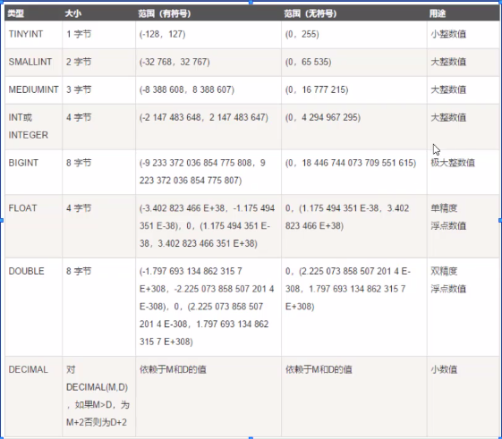
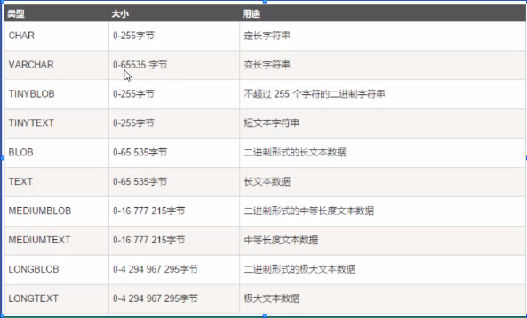
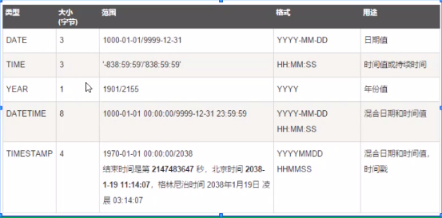

# 关联型数据库（RDBMS）术语

1. 表
2. 数据库：一些关联表的集合
3. 列
4. 行
5. 主键：一个数据表中只能包含一个主键
6. 外键：用于关联两个表
7. 索引：使用索引可快速访问数据库中的特定信息。索引是对数据库表中一列或多列的值进行排序的一种结构，类似于书籍目录

# 自带数据库

1. information_schema
2. performance_schema
3. mysql
4. sys

# 数据库的基本操作

1. 创建数据库：`create database [数据库名称];`
2. 删除数据库：`drop database [数据库名称];`
3. 查看数据库：`show databases;`
4. 使用数据库：`use [数据库名称];`
5. 查看数据库中的表：`show tables;`

# MySQL存储引擎

1. 数据库对象：表、视图、存储过程、函数、触发器、事件等
2. 数据库：存储数据库对象的容器
3. 存储引擎
   * 每一种技术都使用不同的存储机制、索引技巧、锁定水平并且最终提供广泛的不同的功能和能力
4. 什么是事务：作为单个逻辑工作单元执行的一系列操作，要么完全地执行，要么完全地不执行
5. 存储引擎分类：

* MYISAM：不支持事务，也不支持外键，尤其是访问速度快
* INNODB：提供了具有提交、回滚和崩溃恢复能力的事务安全
* MEMORY：使用存在内存中的内容来创建表。每个memory表实际对应一个磁盘文件，格式是.frm

# Navicat连接数据库的方法

1. 连接名可自行设置，作为对某数据库连接的名称
2. 主机选localhost

# SQL功能分类

1. DDL（数据定义语言）：用来定义数据库对象，创建库、表、列等
2. DML（数据操作语言）：从来操作数据库表中的记录
3. DQL（数据查询语言）：用来查询数据
4. DCL（数据控制语言）：用来定义访问权限和安全级别

# SQL支持的数据类型

### 大致分为三类：

1. 数值类型

   

2. 字符串类型

   

3. 日期和时间类型

   

