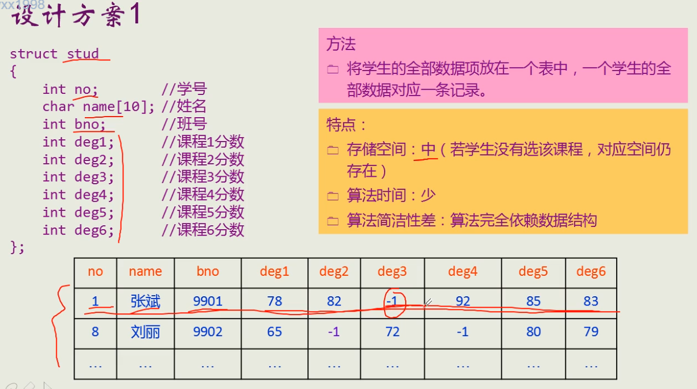
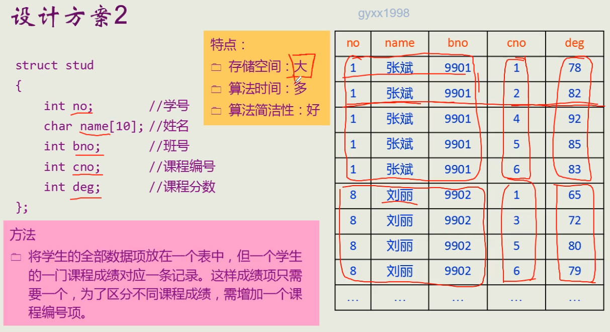
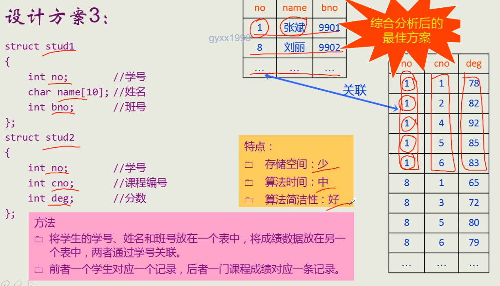

## 设计方案1：

1. 存储空间：中
2. 算法时间：少
3. 算法简洁性：差（算法完全依赖数据结构）

## 设计方案2：

1. 存储空间：大
2. 算法时间：多
3. 算法简洁性：好

## 设计方案3（最优）：

1. 存储空间：少
2. 算法时间：中
3. 算法简洁性：好

### 存储结构的存储能力

1. 如果存储结构的存储能力强、存储信息多，算法将会较好设计
2. 过于不当的存储结构，可能就要对应一套比较复杂的算法
3. 工程中，要处理好时间与空间的矛盾